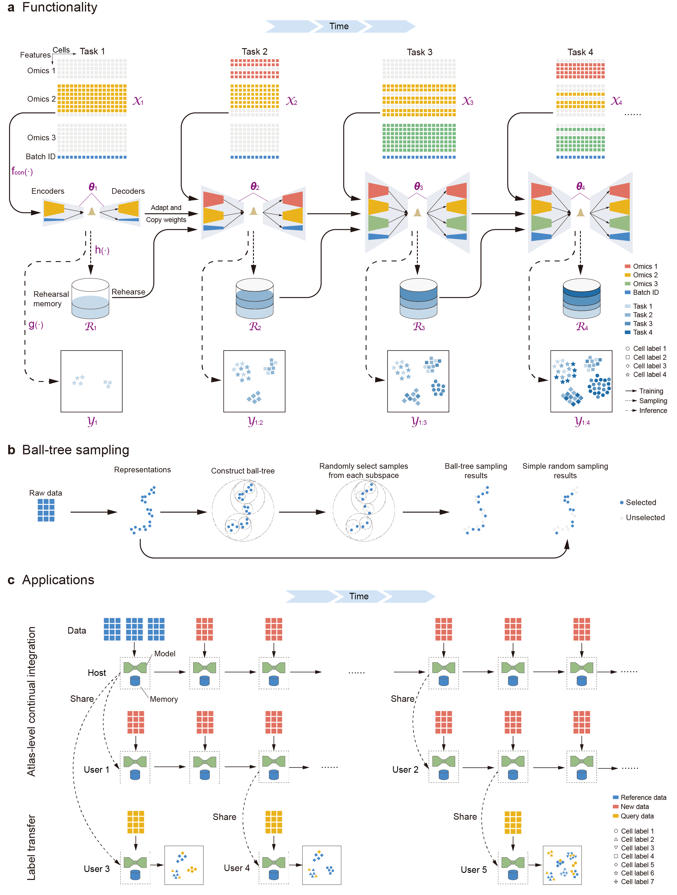

# MIRACLE: A Continual Integration Method for Single-cell Data

<div align="center">
  
</div>

<p align="center">
By employing <strong> dynamic architecture adaptation and data rehearsal strategies </strong>, MIRACLE enables <strong> continual integration  </strong> of diverse datasets while preserving biological fidelity over time.
</p>

---

**MIRACLE** , an online integration framework for multimodal single-cell integration via continual learning (CL). CL enables models to incrementally incorporate new data while preserving previously acquired knowledge. MIRACLE employs CL strategies including dynamic architecture adaptation and data rehearsal to enhance adaptability and knowledge retention. It leverages MIDAS as a base model to support the integration of multimodal mosaic data, enabling online updates across diverse omics. MIRACLE also 
facilitates precise query mapping to reference atlases, improving the accuracy of cell label transfer and novel cell discovery.

- **MIRACLE Documentation:** [**scmiracle.readthedocs.io**](https://miracle-v001.readthedocs.io/index.html)
<!-- - **Publication:** [***Nature Biotechnology***](https://www.nature.com/articles/s41587-023-02040-y) -->

## ✨ Key Features
*    **Boosted Efficiency with Continual Integration**: Incrementally add new data batches to an existing model, which eliminates the need for complete retraining and significantly reduces computational requirements.
*    **Dynamic Feature Space Adaptation**: Seamlessly incorporate new data containing novel features (e.g., new genes or proteins not present in the original dataset). The model dynamically expands its feature space, ensuring no information is lost when integrating data from different technologies or antibody panels.
*    **Intelligent Data Summarization for Rehearsal**: Employs a distribution-preserving sampling strategy (BTS) to compress past data into a small, representative core set. This "rehearsal" dataset enables efficient knowledge retention during updates without needing to store all historical data, making the process highly scalable and shareable.

## 🚀 Installation

Get started with MIRACLE by setting up a conda environment.

```bash
git clone https://github.com/sc-miracle/miracle.git
conda create -n scmiracle python=3.12
conda activate scmiracle
cd miracle
pip install -r docs/source/requirements.txt
pip install -e .
```

## ⚡ Getting Started

To get started, please refer to our [documentation](https://miracle-v001.readthedocs.io/index.html).

## 📈 Reproducibility

To reproduce the results from our publication, please visit the `reproducibility` branch of this repository:
[**https://github.com/sc-miracle/miracle-reproducibility/**](https://github.com/sc-miracle/miracle-reproducibility)

<!-- ## 📜 Citation

If you use MIRACLE in your research, please cite our paper:

He, Z., Hu, S., Chen, Y. *et al*. Mosaic integration and knowledge transfer of single-cell multimodal data with MIDAS. *Nat Biotechnol* (2024). https://doi.org/10.1038/s41587-023-02040-y

```bibtex
@article{he2024mosaic,
  title={Mosaic integration and knowledge transfer of single-cell multimodal data with MIDAS},
  author={He, Zhen and Hu, Shuofeng and Chen, Yaowen and An, Sijing and Zhou, Jiahao and Liu, Runyan and Shi, Junfeng and Wang, Jing and Dong, Guohua and Shi, Jinhui and others},
  journal={Nature Biotechnology},
  pages={1--12},
  year={2024},
  publisher={Nature Publishing Group US New York}
}
``` -->

<!-- ## 🙌 Contributing

We welcome contributions from the community! If you have a suggestion, bug report, or want to contribute to the code, please feel free to open an issue or submit a pull request. -->

## 📝 License

 MIRACLE is available under the [MIT License](https://github.com/sc-miracle/miracle/LICENSE).
